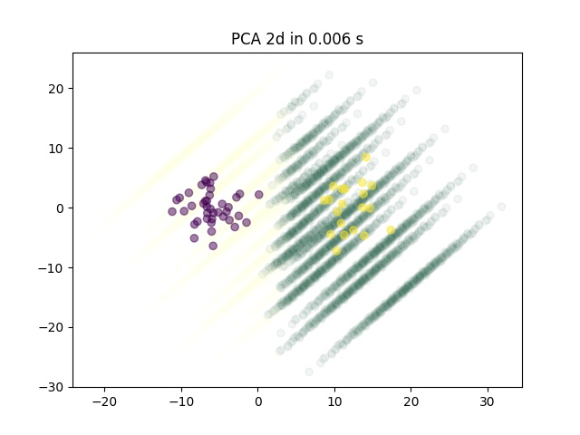

# Visualization-Tool-BinaryClassification

Visualization tool

## Description

Useful tool for dimensionality reduction visualization 

## Visuals




## Installation

```bash
pip install -r requirements.txt
```

## Usage

```python
from src.visualisation.visual_core import DimRedTool
from sklearn.datasets import make_blobs

X, y = make_blobs(n_samples=[1000, 20], centers=None, n_features=6, random_state=1, cluster_std=3)

params = {
    'X': X, 'y': y, 'clf_separator_name': 'log_reg', 'data_dir_path': 'data',
    'balance_method_name': 'undersample_centroid', 'sampling_strategy': 0.5, 'num_points_per_dim': 4,
    'save_rotate_gif': True, 'save_2d_img': True, 'elev': 10, 'seed': 47, 'n_neighbors': 10,
    'dim_red_method_name': 'all'
}
# through initialization will be rebalance classes 
dim_red_tool = DimRedTool(**params)  
# in current settings will save plot with pca.variance_ratio
dim_red_tool.pca_var_info()  
# in current settins will save plots 2d and 3d embeddings of different methods of dime reduction
dim_red_tool.visualize_dim_red()  
```

## Contributing
Pull requests are welcome. For major changes, please open an issue first to discuss what you would like to change.

Please make sure to update tests as appropriate.
